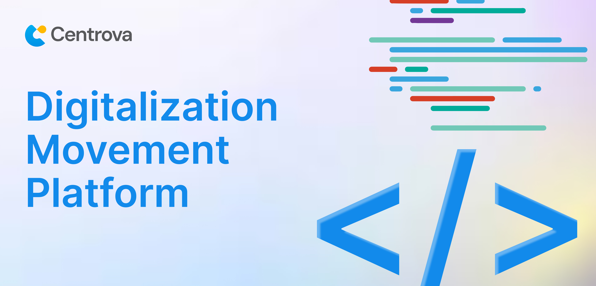

 <!-- opsional, bisa diganti banner -->

## Open. Collaborative. Adaptive.

Centrova adalah startup teknologi Indonesia yang bergerak di bidang solusi digital untuk mendukung transformasi bisnis.  
Kami menghadirkan layanan pengembangan website, aplikasi, desain UI/UX, serta perangkat lunak bisnis kustom.  

Fokus kami adalah menyediakan ekosistem teknologi yang **fleksibel, terjangkau, dan berkelanjutan** untuk membantu pelaku usaha menengah hingga besar menghadapi tantangan digitalisasi. 

---

## About Centrova

> Visi kami adalah menjadi platform teknologi terbaik yang menyediakan inovasi, layanan terbaik, dan memberdayakan setiap orang di seluruh dunia melalui solusi digital.

Kami percaya transformasi digital adalah keniscayaan, dan Centrova hadir untuk memberikan solusi terintegrasi yang bisa beradaptasi dengan kebutuhan lintas sektor.  

**Layanan utama:**
- Website Development  
- Mobile & Desktop Application  
- UI/UX Design  
- CRM & ERP Software Solutions  

---

## Code of Conduct

Seluruh proyek di bawah naungan Centrova mengikuti [Centrova Open Source Code of Conduct](https://github.com/centrova/.github/blob/main/CODE_OF_CONDUCT.md).  
Untuk informasi lebih lanjut, silakan lihat [Code of Conduct FAQ]([https://github.com/centrova](https://github.com/Centrova-ID)).  

---
